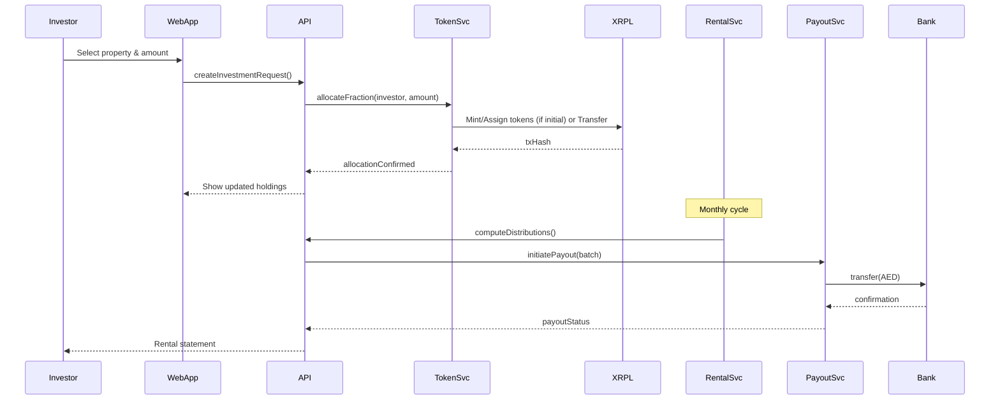
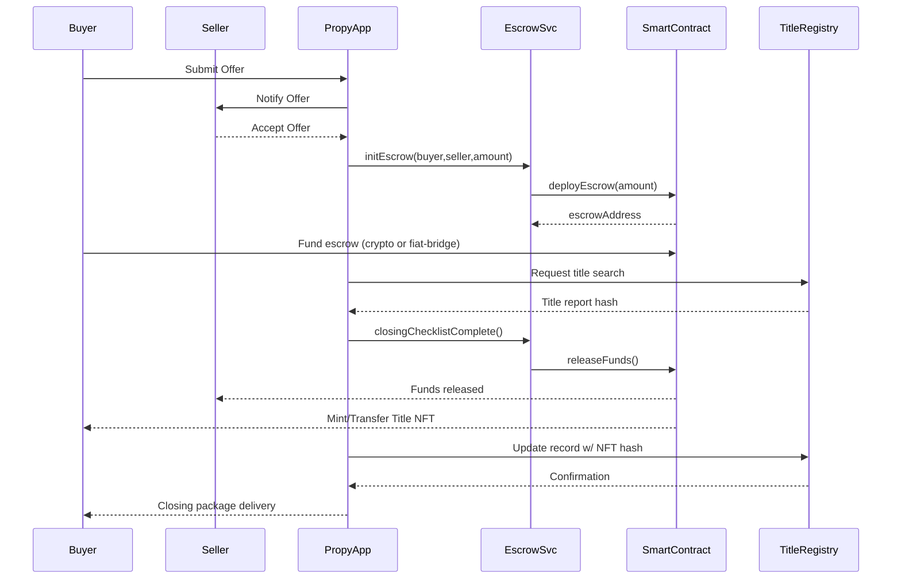

# PRYPCO Mint vs. Propy – Comprehensive Comparison (As of 12 Sept 2025)

> NOT INVESTMENT ADVICE. Educational summary compiled from publicly available descriptions, press materials, and typical market data as of 12 Sept 2025. Always verify current terms, pricing, regulation, and token values directly on official platforms before acting.

---
## 1. Executive Snapshot
| Aspect | PRYPCO Mint | Propy |
|--------|-------------|-------|
| Core Proposition | Fractional investment in Dubai income properties via regulated tokenization | Global end‑to‑end digital property purchase & sale incl. crypto payments |
| Geographic Scope (Current Focus) | Dubai / UAE (pilot, expansion planned) | Global (notably US & EU; cross‑border facilitation) |
| Entry Minimum | ~AED 2,000 (~USD 545) | Full property: market price (often USD 100K+); Fractional NFTs: from ~USD 1K–10K |
| Income Focus | Yes – monthly rental distributions | Not primary; platform supports transactions & ownership transfer |
| Liquidity Mechanism | Semi‑annual secondary “exit windows” inside platform | NFT title / fractional NFTs tradeable (jurisdiction-dependent); property resale off‑platform |
| Token Type | Asset‑backed fractional property tokens (non‑crypto, XRP Ledger records) | Property Title NFTs + PRO ERC‑20 utility token |
| Payments (Pilot Phase) | Fiat (AED bank transfer) only | Fiat + Crypto (USD, EUR, BTC, ETH, PRO, etc.) |
| Regulatory Backbone | Dubai Land Department (DLD) & VARA alignment | Local real estate/title/escrow licenses (esp. US); compliance frameworks per jurisdiction |
| Typical Fees | 2% DLD (discounted from 4%); modest platform transaction fee (<1% est.) | Platform 1–3% + escrow/title + gas fees; discounts w/ PRO token |
| Yield / Rewards | Rental yield (Dubai ~5–8% gross typical range) | Staking rewards (PRO ~5–10% APY indicative; variable) |
| User Target | Yield‑seeking fractional investors in Dubai | Buyers / sellers / agents needing digital & crypto-enabled closings |

---
## 2. Platform Deep Dives
### 2.1 PRYPCO Mint
- **Launch:** May 2025 pilot; first licensed tokenized real estate project in MENA (per platform statements).
- **Objective:** Democratize Dubai property access via fractional shares encoded as tokens on the XRP Ledger (facilitated by Ctrl Alt technology stack).
- **Ownership Model:** Each token = legally recognized co‑ownership share registered with DLD; digital certificate + on‑chain record.
- **Portfolio Focus:** Ready-to-rent residential (e.g., Dubai Hills, premium mid/high‑rise apartments) emphasizing stabilized rental yields.
- **Income Distribution:** Monthly AED rental payouts proportional to token holdings (net of property-level expenses/management).
- **Liquidity:** Internal secondary market during defined “exit windows” (e.g., twice yearly). Outside windows, holdings are typically locked.
- **Planned Roadmap:** Potential future global expansion, eventual crypto funding rails post-pilot, broadened asset classes (as stated in public forward-looking notes).

#### Indicative Economics Example (Illustrative Only)
| Item | Example Value |
|------|---------------|
| Property Value | AED 2,400,000 |
| Total Tokens | 1,200 |
| Token Price (Initial) | AED 2,000 |
| Minimum Entry | 1 token (AED 2,000) |
| Gross Yield Range (Market Typical) | 5–8% (Before platform/DLD entry cost) |
| DLD Fee (Discounted) | 2% (one‑time on acquisition amount) |
| Secondary Trade Fee | ~0.5–1% (est., confirm in‑app) |
| Rental Distribution Cadence | Monthly |

> NOTE: Actual yields depend on occupancy, rent levels, expenses; confirm precise economics per listing.

### 2.2 Propy
- **Founded:** 2017; pioneer in blockchain-assisted global real estate transactions.
- **Scope:** Digital process automation (offer, escrow, title, closing) + NFT deed / fractional NFT models + crypto & fiat settlement.
- **Ownership Model:** For full properties, NFT represents digital title/deed mapped to conventional county / jurisdiction records; fractional models use NFT shards / DAO-like governance (where supported). Legal enforceability relies on integrated contractual frameworks plus jurisdictional compliance.
- **Utility Token (PRO):** ERC‑20 used for fee payment discounts, staking, governance features, and incentivized ecosystem participation.
- **Automation Components:** Smart contract escrow, e-sign, digital audit trail, AI compliance checks, integrated KYC.
- **Transaction Speed Benefit:** Aims to compress traditional weeks/months closing into days by reducing manual coordination.

#### PRO Token Market Snapshot (12 Sept 2025)
| Metric | Approximate Value |
|--------|-------------------|
| Price | USD 0.70 |
| 24h Range | USD 0.69 – 0.72 |
| Circulating Supply | ~100M PRO |
| Market Cap | ~USD 70M |
| 24h Volume | ~USD 9–10M |
| Historical ATH (2021) | ~USD 1.50 |

> Prices are volatile; verify live data on official market aggregators.

#### Sample Full Property Transaction Cost Stack (Illustrative)
| Component | Example (USD 200K Property) |
|-----------|-----------------------------|
| Base Purchase Price | 200,000 |
| Platform Fee (2%) | 4,000 |
| Title & Escrow (Jurisdictional) | 1,500 |
| Blockchain / Gas (ETH ops) | 10–50 |
| Optional PRO Discount (e.g., 1% off fee) | -2,000 *if applied on larger deals; example only* |
| Estimated Total | ~205,500 (pre-discount) |

> Jurisdiction taxes, inspections, appraisals, and transfer duties are additional and vary widely.

---
## 3. Pricing & Fees Overview
| Category | PRYPCO Mint | Propy |
|----------|-------------|-------|
| Acquisition Entry | Token price (property value ÷ tokens) | Market property price or fractional NFT share price |
| Minimum Capital | ~AED 2,000 | Fractional: ~USD 1K–10K; Full: USD 100K+ typical |
| Primary Platform Fees | Discounted DLD 2% + low transaction fee | 1–3% platform, plus escrow/title, gas |
| Ongoing Holding Fees | Implicit in net rental distributions; no explicit mgmt fee publicly highlighted | None platform-specific unless using staking or specialized services |
| Exit / Liquidity Fees | Secondary trade fee (~0.5–1%) | Marketplace/NFT trading fees, gas, potential brokerage costs |
| Yield / Rewards | Rental yield distributions | PRO staking rewards (variable APY) |

---
## 4. Process Flows
### 4.1 PRYPCO Mint Investment Flow
1. Register & KYC (UAE ID / Passport) in app/web.
2. Browse curated properties (valuation, token count, yield projections, documents).
3. Choose allocation (≥ AED 2,000) and transfer AED via bank.
4. Token allocation recorded on XRP Ledger; DLD co‑ownership certificate issued.
5. Monthly rental income credited (net basis). Track dashboard metrics.
6. Optional: Participate in secondary exit window to sell tokens.
7. Long-term: Property disposal event (end of strategy horizon) yields pro‑rata capital return.

### 4.2 Propy Transaction Flow (Full Property)
1. Create account & complete KYC; connect crypto wallet (optional for fiat deals).
2. Browse or list property; review disclosures, virtual tours.
3. Submit / receive offer via smart contract; funds reserved (escrow).
4. Conduct due diligence (inspection reports, title search, legal docs). AI compliance assists.
5. Execute digital closing package; NFT title minted / transferred post settlement.
6. Funds released to seller (fiat or crypto). Ownership recorded both on‑chain and in conventional registry.
7. (Optional) Stake PRO or trade NFT (if structure permits secondary transfer).

### 4.3 Propy Fractional / NFT Share Flow
1. Identify fractionalized asset offering (jurisdiction permitting).
2. Purchase fractional NFT shares (crypto or fiat → wrapped structure).
3. Governance / usage rights encoded (e.g., revenue share, usage schedule) – varies by offering.
4. Resell on compatible NFT marketplace (subject to securities/transfer restrictions where applicable).

---
## 5. Regulatory & Legal Considerations
| Topic | PRYPCO Mint | Propy |
|-------|-------------|-------|
| Primary Regulator(s) | Dubai Land Department (property registration); VARA alignment for digital aspects | Local real estate licensing bodies, title/escrow regulators (e.g., US state-level), AML/KYC compliance frameworks |
| Ownership Evidence | DLD co‑ownership certificate + on‑chain token ledger | NFT deed + traditional registry record alignment |
| Investor Eligibility (Pilot) | Primarily UAE residents; expanding global | Global (subject to KYC & jurisdictional restrictions) |
| Securities Characterization | Positioned as direct property co‑ownership (verify jurisdictional interpretation) | Depends on structure; full property = asset sale; fractional NFTs may trigger securities analysis |
| AML / KYC | Mandatory pre‑investment | Mandatory pre‑offer/closing |

> Always seek legal counsel on cross‑border property and tokenized asset compliance.

---
## 6. Token / Asset Model Differences
| Dimension | PRYPCO Mint | Propy |
|-----------|-------------|-------|
| Representation | Fungible-like fractional property shares (fixed supply per property) | Non‑fungible tokens (titles) + ERC‑20 PRO utility + optional fractional NFT shards |
| Value Link | Directly to underlying property share NAV & rental performance | Market valuation of property/NFT + PRO token market dynamics |
| Volatility Drivers | Dubai property market, rental yield variance | Real estate market + crypto market (PRO, ETH, BTC) + NFT market sentiment |
| Custody | Platform records + DLD register; no external wallet needed (pilot) | User crypto wallet (self‑custody) + traditional title records |

---
## 7. Benefits & Risks
### 7.1 PRYPCO Mint
**Benefits:** Low capital threshold, regulated property registry backing, passive rental income, diversification across multiple Dubai units, simplified fiat onramp, transparency via ledger.
**Risks:** Geographic concentration (Dubai), limited liquidity outside windows, pilot-stage operational risk, real estate market cycles, potential vacancy reducing yields.

### 7.2 Propy
**Benefits:** Global reach, speed & automation, crypto/fiat flexibility, NFT portability, potential fee savings via PRO, transparent audit trails.
**Risks:** Crypto/token volatility, jurisdictional complexity, regulatory evolution (especially for fractional NFTs), gas fee variability, reliance on stable legal mapping of NFT → title.

---
## 8. Comparative Scenario Guidance (Illustrative)
| Investor Goal | More Suitable Platform | Rationale |
|---------------|------------------------|-----------|
| Earn passive AED rental yields with small capital | PRYPCO Mint | Built for fractional income participation |
| Purchase entire overseas property using crypto | Propy | Supports full transaction & crypto settlement |
| Diversify into multiple Dubai rentals | PRYPCO Mint | Low minimum fractional exposure |
| Leverage staking rewards & governance in Web3 real estate | Propy | PRO token utility & staking |
| Minimize early speculative token volatility exposure | PRYPCO Mint | Fiat-only pilot; tokens tied to property not open market crypto |

---
## 9. Key Links & Resources
### Official Platforms
- PRYPCO Main Site: https://prypco.com
- PRYPCO Mint (App/Portal): https://mint.prypco.com
- Propy Platform: https://propy.com

### Technology & Ledger References
- XRP Ledger (XRPL): https://xrpl.org
- Ethereum (Smart Contracts): https://ethereum.org

### Regulatory / Government (Contextual)
- Dubai Land Department (DLD): https://dubailand.gov.ae
- (Context) UAE Virtual Assets Regulatory Authority (VARA): https://vara.ae

### Token / Market Data (PRO)
- CoinMarketCap – PRO: https://coinmarketcap.com/currencies/propy
- CoinGecko – PRO: https://www.coingecko.com/en/coins/propy

### Exchanges Listing PRO (Examples)
- Coinbase: https://www.coinbase.com/price/propy
- Binance: https://www.binance.com/en/trade/PRO_USDT
- Kraken: https://www.kraken.com/prices/propy

> Always verify regional availability and compliance when using exchanges.

### Additional Reading / Concepts
- Tokenized Real Estate Primer (Generic): https://www.weforum.org/ (search "tokenized assets")
- Smart Contract Escrow Concept: https://consensys.net (search "escrow")

---
## 10. Glossary (Selected Terms)
| Term | Definition |
|------|------------|
| Tokenization | Converting ownership rights in an asset into digital tokens on a ledger. |
| Fractional Ownership | Dividing property equity into multiple investable units. |
| NFT Deed | Non‑fungible token representing property title or interest. |
| Escrow | Neutral holding arrangement for funds/documents until conditions met. |
| Yield (Rental) | Annualized rent / property value (gross or net). |
| APY (Staking) | Annual Percentage Yield from locking tokens in protocol rewards. |
| Liquidity Window | Predefined period when secondary trades are permitted. |
| KYC / AML | Identity verification and anti‑money laundering compliance processes. |

---
## 11. Due Diligence Checklist (Investor Reference)
| Area | Questions to Verify |
|------|--------------------|
| Legal Structure | Are tokens direct ownership or via SPV? What jurisdiction? |
| Fees | Full itemization of acquisition, ongoing, and exit fees? |
| Yield Assumptions | Based on current leases? Historical occupancy? |
| Liquidity | Exact frequency & rules of secondary trading / lockups? |
| Regulatory Status | Confirm current licenses & approvals (DLD, local title regulators). |
| Custody & Security | How are records stored? Encryption & audit policies? |
| Tax Implications | Withholding, capital gains, cross‑border reporting? |
| Exit Strategy | Timeline for property sale or forced liquidation conditions? |

---
## 12. Disclaimers & Limitations
- Figures are illustrative; platform terms can change without notice.
- Rental yields and staking APYs are variable and not guaranteed.
- Tokenized real estate may present unique legal classification issues across borders.
- Cryptocurrency usage introduces additional volatility and regulatory considerations.
- Always consult qualified legal, tax, and investment professionals.

---
## 13. Update & Maintenance Notes
- Data timestamp: 12 Sept 2025.
- Recommended refresh cadence: Quarterly or upon major platform announcement (licensing, fee changes, token economic revisions, geographic expansion).

---
### Summary
PRYPCO Mint streamlines fractional, yield-focused Dubai property exposure with regulated backing and a low entry threshold. Propy addresses holistic, global property transactions leveraging NFTs, smart contracts, and its PRO token to enable faster, crypto-compatible deals. Choice depends on whether your objective centers on passive rental exposure in a focused market (PRYPCO Mint) or broad transactional flexibility and crypto integration (Propy).

---
*End of Document*

---
## 14. Reference System Architectures (Hypothetical Models)
> The following architectures and folder structures are illustrative reconstructions based on common industry patterns for tokenized real estate and digital property transaction platforms. They are NOT official repositories. Use them as conceptual guides.

### 14.1 PRYPCO Mint – Layered Architecture (Conceptual)
```
+-----------------------------+        +---------------------------+
| Mobile / Web Clients       |<------>|  Notification Service     |
| (Flutter / React / iOS)    |        |  (Email/SMS/Push)         |
+--------------+--------------+        +------------+--------------+
							 | REST/GraphQL                     ^ Events
							 v                                   |
				+------+--------------------------+        |
				|  API Gateway / BFF (NestJS?)    |--------+
				+------+--------------------------+
							 | AuthZ / Rate Limit
							 v
	 +-----------+-------------------------------+
	 | Core Services (Microservices / Modules)   |
	 |-------------------------------------------|
	 | - User & KYC Service                      |
	 | - Property Catalog Service                |
	 | - Tokenization Orchestrator               |
	 | - Fraction Allocation Service             |
	 | - Rental Income & Distribution Service    |
	 | - Secondary Market / Matching Engine      |
	 | - Compliance & Reporting Service          |
	 +-----------+-------------------------------+
							 | On-chain Adapter (XRPL SDK)
							 v
				+------+--------------------------+
				| Blockchain Integration (XRPL)   |
				| - Token Mint / Burn (per prop)  |
				| - Ownership Ledger Sync         |
				| - Transaction Hash Storage      |
				+------+--------------------------+
							 |
							 v
	 +-----------+-------------------------------+
	 | Data Layer                                |
	 | - Relational DB (PostgreSQL)              |
	 | - Document Store (MongoDB) (meta/docs)    |
	 | - Object Storage (leases, images)         |
	 | - Caching (Redis)                         |
	 +-------------------------------------------+
```

### 14.2 Propy – Hybrid Smart Contract & Service Mesh (Conceptual)
```
Clients (Web / Agent Portal / Wallet UI)
				|
				v
 API Gateway / GraphQL Federation
				|
	+-----+---------------------------+---------------------------+
	|             Domain Services                                  |
	|--------------------------------------------------------------|
	| Listing Service | Offer & Escrow Service | Title Registry API |
	| Payment Routing | KYC/AML Service        | NFT Minting Svc    |
	| Doc Management  | Staking/Governance     | Notification       |
	+-----------------+------------------------+--------------------+
											|                |
											|Events (Kafka)  |Smart Contract Calls
											v                v
								 Off-chain Orchestrators      Ethereum / L2 / Sidechains
								 (State Machines)             - Escrow Smart Contracts
																							- NFT Title Contracts
																							- PRO Token (ERC-20)

Data Persistence:
 - Relational DB (Transactions, KYC, Escrow States)
 - IPFS / Decentralized storage (select documents / hashes)
 - Search Index (Elastic/OpenSearch for listings)
 - Cold archive (compliance)
```

---
## 15. Illustrative Repository / Folder Structures

### 15.1 PRYPCO Mint (Hypothetical Monorepo Layout)
```
prypco-mint/
	apps/
		web-portal/            # Next.js/React front-end
		mobile-app/            # Flutter or React Native codebase
		admin-console/         # Ops dashboards (property onboarding)
	services/
		user-service/          # Auth, profiles, KYC status
		kyc-service/           # Vendor integration (e.g., SumSub / Trulioo)
		property-service/      # CRUD, valuation metadata
		tokenization-service/  # Lifecycle: mint fractions, freeze, burn
		rental-service/        # Rent ingestion, distribution scheduler
		payout-service/        # Bank transfer integration, reconciliation
		secondary-market/      # Order book / matching engine
		compliance-service/    # Audit logs, regulatory exports
		notification-service/  # Email/SMS/push templating
		reporting-service/     # Investor statements
	blockchain/
		xrpl-adapter/          # XRPL client wrappers, signing utilities
		ledger-sync-worker/    # Polls ledger, reconciles DB state
	libs/
		shared-models/         # TypeScript / Proto / OpenAPI schemas
		logging/               # Structured logging utils
		security/              # JWT, RBAC middlewares
	infra/
		k8s/                   # Deployment manifests
		terraform/             # Cloud infra (VPC, DBs, secrets)
		ci-cd/                 # Pipeline configs
	docs/
		architecture/          # ADRs, sequence diagrams
		compliance/            # Regulatory mapping documents
	scripts/                 # CLI maintenance tools
	tests/
		integration/
		load/
	README.md
```

### 15.2 Propy (Hypothetical Multi-Repo Aggregation)
```
propy-platform/
	gateway-api/             # GraphQL/REST federation layer
	listing-service/         # Property listings, filters, media
	offer-escrow-service/    # Offer flow & escrow lifecycle
	title-registry-adapter/  # Interface to jurisdiction registries
	nft-minter/              # Title NFT & fractional mint orchestration
	payments-service/        # Fiat rails (bank, card), crypto settlement
	kyc-aml-service/         # Identity, sanctions screening
	staking-governance/      # PRO staking APR calc, reward distribution
	document-service/        # Storage, hash notarization (IPFS integration)
	notification-service/    # Multi-channel messaging
	analytics-etl/           # Data warehouse ingestion
	search-indexer/          # Listing + metadata search maintenance
	smart-contracts/
		erc20-pro-token/       # PRO token contract + upgrades
		escrow-contracts/      # Escrow state machines (solidity)
		title-nft-contract/    # ERC-721 / ERC-1155 deeds or fractions
		governance-contracts/  # Voting, staking reward logic
	infra/
		helm-charts/
		terraform/
		monitoring/            # Prometheus/Grafana dashboards
	shared-libs/
		proto-schemas/
		auth-lib/
		event-schemas/
	tests/
		contract-tests/
		e2e/
	docs/
		flows/
		legal/
		security/
	scripts/
```

---
## 16. Token Creation & Mechanics (Conceptual Breakdown)

### 16.1 PRYPCO Mint Fractional Token Lifecycle (XRPL-Based – Hypothetical)
| Stage | Action | Components |
|-------|--------|------------|
| Property Onboarding | Admin inputs valuation, legal docs, token count | admin-console, property-service |
| Allocation Plan | System computes tokens (e.g., value ÷ min increment) | tokenization-service |
| Mint Preparation | Create XRPL trust line / issuer account setup | xrpl-adapter |
| Token Mint | Issue fixed-supply tokens representing 100% equity | tokenization-service + XRPL |
| Distribution | Assign tokens to investor sub-accounts post-AED settlement | payout/ledger-sync |
| Rental Accrual | Aggregate rent, compute pro‑rata shares | rental-service |
| Payout | Trigger batch bank transfers; ledger note for audit | payout-service, compliance-service |
| Secondary Trade | Match buy/sell orders during window; internal ledger updates | secondary-market |
| Redemption / Exit | Burn tokens on property sale; distribute proceeds | tokenization-service, payout-service |

Security Controls (illustrative):
- Multi-sig for issuer wallet operations.
- Separation of duties: mint vs. distribution approvals.
- Hash anchoring of legal docs (SHA-256) stored on-chain as memo fields.

### 16.2 Propy PRO Token & NFT Mechanics (Ethereum – Simplified)
| Component | Purpose | Notes |
|----------|---------|-------|
| PRO (ERC-20) | Utility / fee discounts / staking | Upgradeable proxy pattern possible |
| Escrow Contracts | Hold funds until conditions met | Time locks & dispute resolution slots |
| Title NFT (ERC-721) | Represents unique property deed | Meta includes IPFS hash of legal packet |
| Fractional NFTs (ERC-1155 or Vault Shares) | Shared ownership slices | May require Reg CF/Reg A compliance (US) |
| Staking Contract | Distributes rewards to PRO stakers | Emissions schedule & halving logic |
| Governance (DAO) | Parameter voting (fees, rewards) | Token-weighted voting, quorum rules |

Lifecycle (Property Transfer):
1. Listing Created → Metadata pinned (IPFS) → Listing ID.
2. Offer Accepted → Escrow contract deployed/funded.
3. Due Diligence Checks → Oracles / off-chain attestations posted.
4. Closing Conditions Met → Escrow releases funds → NFT minted to buyer.
5. Record Synchronization → Off-chain registry updated; hash stored.
6. Optional Fractionalization → NFT locked in vault → Fractions minted & distributed.

Risk Mitigations:
- Upgradable contracts restricted via multi-sig & timelock.
- Continuous monitoring of escrow balances (watcher service).
- Formal verification / audits for critical escrow logic.

---
## 17. Flowcharts & Sequence Diagrams (Mermaid Notation)

### 17.1 PRYPCO Mint – Investment & Rental Distribution


### 17.2 Propy – Full Property Closing


### 17.3 Propy – Fractionalization Extension
```mermaid
flowchart LR
	A[Title NFT Owned] --> B[Lock in Vault Contract]
	B --> C[Mint Fractional ERC-1155 Tokens]
	C --> D[Distribute to Investors]
	D --> E[Secondary Trading (DEX/Marketplace)]
	E --> F[Governance / DAO Decisions]
	F -->|Vote to Sell| G[Aggregate Buyout Offer]
	G -->|Execute| H[Vault Burns Fractions & Releases NFT]
```

---
## 18. Additional Security & Compliance Controls (Illustrative)
| Domain | Control Examples |
|--------|------------------|
| Identity & Access | RBAC with least privilege; Just-in-Time admin elevation |
| Key Management | HSM-backed signing keys for mint/burn; rotation policy |
| Data Protection | Field-level encryption (PII); TLS 1.3 enforced |
| Monitoring | SIEM aggregation of ledger + app events; anomaly detection |
| Auditing | Immutable append-only logs; periodic third-party audits |
| Business Continuity | Multi-region DB replicas; ledger resync procedures |
| Smart Contract | Formal verification (escrow); external audits & bug bounties |
| Regulatory Reporting | Automated generation of investor statements & tax files |

---
## 19. Extended Disclaimer (Augmented)
The architectural diagrams, repository structures, and token mechanic lifecycles above are hypothetical educational constructs inferred from typical industry practices and may not represent the proprietary internal implementations of PRYPCO or Propy. They should not be treated as reverse-engineered or authoritative specifications. Always defer to official technical documentation or direct company communications for production details.

---
*Document Extended with Architecture & Mechanics Sections – 12 Sept 2025*

---
## 20. How to List and Sell Your Property on PRYPCO Mint

If you are a property owner and want to tokenize and sell your property on PRYPCO Mint, follow these steps:

### Step-by-Step Process for Owners
1. **Register on PRYPCO Mint:** Go to [https://mint.prypco.com/](https://mint.prypco.com/) and create an account. Complete KYC verification (UAE ID or passport required).
2. **Submit Property Details:** Provide all required information—property address, legal documents, valuation, size (sqm), and photos/videos.
3. **Property Review & Approval:** PRYPCO and Dubai Land Department (DLD) review your submission for compliance and eligibility.
4. **Tokenization Setup:**
	- The platform calculates the total number of tokens based on your property’s size and value (see formula below).
	- Legal documentation is prepared to ensure each token represents a fractional ownership share, backed by DLD certificate.
5. **Token Minting:** Tokens are created on the XRP Ledger, each representing an equal share of ownership.
6. **Listing & Sale:** Your property is listed on the PRYPCO Mint marketplace. Investors can purchase tokens (up to 20% per investor).
7. **Income Distribution:** Rental income and appreciation are distributed pro-rata to token holders.
8. **Secondary Market:** After initial sale, tokens can be traded during exit windows.

---
## 21. Token Calculation Formula & Division Logic

Tokens on [https://mint.prypco.com/](https://mint.prypco.com/) are calculated and divided using a clear formula based on the property’s total value and chosen token quantity.

### Token Calculation Formula
- **Token Value** = Property Price ÷ Number of Tokens
- Example: A property priced at AED 2,600,000 divided into 1,300,000 tokens results in each token valued at AED 2.
- PRYPCO Mint typically breaks down every square metre into 10,000 tokens, so the total tokens depend on the property’s size (e.g., a 130 sqm property = 1,300,000 tokens).

### How Tokens Are Divided
- The property’s total value is split into thousands of tokens, each representing an equal share of ownership.
- Investors can purchase up to 20% of the total tokens per property, ensuring broad ownership distribution.
- Every token corresponds to a fractional legal ownership backed by a DLD-issued certificate.
- Income (rent, appreciation) is distributed **pro-rata** based on the number of tokens held.

### Step-by-Step Example
| Property Price | Size (sqm) | Tokens per sqm | Total Tokens | Value per Token |
|:--------------:|:----------:|:--------------:|:------------:|:---------------:|
| AED 2,600,000  | 130        | 10,000         | 1,300,000    | AED 2           |

- The division ensures each token equally shares in rental income, capital appreciation, and legal ownership rights.

--------------------------------------------------------------------------------------------
-----------------------------> Prypco Mint Tokenization Guide <-----------------------------
--------------------------------------------------------------------------------------------

This text file provides a comprehensive explanation of how Prypco Mint tokenizes real estate properties in Dubai. It is designed to be fully knowledgeable and accessible for any person, whether you're a beginner investor, property owner, or just curious about blockchain-based real estate. I'll explain the process step-by-step, the mathematics behind it, and include real-world examples. All information is based on Prypco Mint's operations as of August 2025, regulated by the Dubai Land Department (DLD).
Section 1: Overview of Prypco Mint
Prypco Mint is the Middle East and North Africa's first tokenized real estate investment platform, launched in May 2025 by the Dubai Land Department (DLD) in partnership with Prypco and Ctrl Alt Solutions. It allows investors to buy fractional shares of Dubai properties starting from AED 2,000 (about $545 USD). Each token represents a legal share of ownership, backed by the DLD. The platform uses the XRP Ledger (XRPL) for secure, transparent transactions. Key benefits include:
- Low entry barrier for real estate investment.
- Monthly rental income distributed automatically.
- Reduced DLD registration fees (2% instead of 4%).
- Secondary market for selling tokens.
- Global accessibility, with plans for expansion beyond the UAE.
Transactions are in UAE Dirhams (AED), not crypto, during the pilot phase for compliance.
Section 2: The Tokenization Process
Tokenization divides a property's value into digital tokens on the blockchain. Here's how it works:
1. Property Selection and Valuation:
   - Properties are vetted and approved by the DLD.
   - Fair market value (V) is appraised officially, often set below market price for attractiveness.
2. Token Creation:
   - The property is divided into a fixed number of tokens (N). N is chosen to make tokens affordable (e.g., AED 1-5 per token).
   - Each token represents an equal fraction of the property.
3. Token Pricing:
   - Price per token (P) = V / N.
4. Purchase:
   - Investors buy at least AED 2,000 worth of tokens.
   - Ownership is registered legally with the DLD.
5. Benefits Distribution:
   - Rental income and appreciation are shared pro-rata based on tokens held.
6. Secondary Market:
   - Tokens can be resold, providing liquidity.
Section 3: The Mathematics Behind Tokenization
The math is based on simple proportions and divisions. No complex formulas are needed—just basic arithmetic for fractional ownership.
Key Formulas:
- Token Price (P): P = V / N
  - V = Total property value in AED.
  - N = Total number of tokens (fixed per property, e.g., 1,000,000 for larger properties).
- Ownership Fraction (F): F = k / N
  - k = Number of tokens you buy.
  - Alternatively, F = Investment Amount / V.
- Minimum Tokens (k_min): k_min = ceil(2000 / P)
  - ceil means round up to the nearest whole number, since tokens are indivisible.
- Rental Income Share (I): I = (k / N) * R
  - R = Total annual rental income from the property.
- Capital Gain (G): G = k * (P_new - P)
  - P_new = New token price if property value appreciates to V_new (P_new = V_new / N).
Section 4: Example 1 - Real Prypco Mint Property
From Prypco's first listing (a Damac unit):
- V = AED 2,400,000
- N = 1,000,000 (approximate based on platform examples)
- P = 2,400,000 / 1,000,000 = AED 2.40 per token
If you invest AED 2,000:
- k = ceil(2000 / 2.40) = ceil(833.33) = 834 tokens
- Actual cost: 834 * 2.40 = AED 2,001.60
- F = 834 / 1,000,000 = 0.000834 or 0.0834%
If annual rent R = AED 100,000:
- I = (834 / 1,000,000) * 100,000 = AED 83.40
If property appreciates to V_new = AED 3,000,000:
- P_new = 3,000,000 / 1,000,000 = AED 3.00
- G = 834 * (3.00 - 2.40) = 834 * 0.60 = AED 500.40
Section 5: Example 2 - Your 255 Square Foot Property
Assuming a 255 sq ft property in a mid-range Dubai area (e.g., JVC):
- Price per sq ft = AED 1,500 (estimate; adjust based on location)
- V = 255 * 1,500 = AED 382,500
- N = 200,000 (chosen to keep P affordable)
- P = 382,500 / 200,000 = AED 1.9125 per token
If you invest AED 2,000:
- k = ceil(2000 / 1.9125) = ceil(1045.75) = 1,046 tokens
- Actual cost: 1,046 * 1.9125 ≈ AED 2,000.48
- F = 1,046 / 200,000 = 0.00523 or 0.523%
If annual rent yield = 5% (common in Dubai), R = 0.05 * 382,500 = AED 19,125
- I = (1,046 / 200,000) * 19,125 ≈ AED 100 per year
If property appreciates 20% to V_new = AED 459,000:
- P_new = 459,000 / 200,000 = AED 2.295
- G = 1,046 * (2.295 - 1.9125) = 1,046 * 0.3825 ≈ AED 400
Section 6: Risks and Considerations
- Market Risks: Property values can fall, affecting token prices.
- Fees: Platform fees, 2% DLD fee, potential management fees.
- Regulations: Must comply with UAE laws; KYC required for investors.
- Taxes: Rental income may be taxable; consult a tax advisor (no specific tax advice here).
- Liquidity: Secondary market exists but may not be as liquid as stocks.
Section 7: How to Get Started
- Visit mint.prypco.com to sign up.
- Verify identity (KYC).
- Browse listings and invest.
- For property owners: Submit your property for tokenization via the platform.
This guide is for educational purposes. Always verify with official sources or professionals before investing.