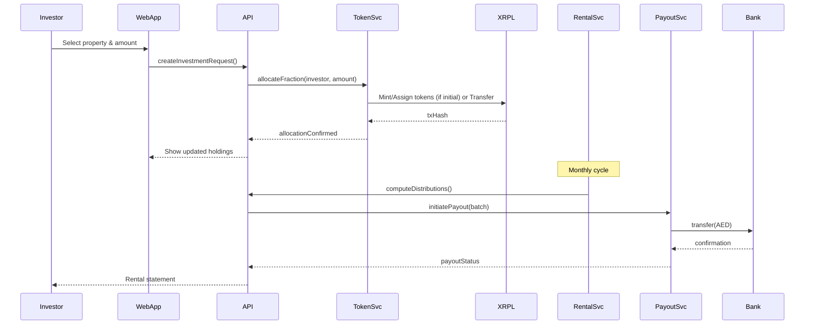

# PRYPCO Mint - Tokenized Real Estate Investment Platform

> Educational summary compiled from publicly available descriptions and documentation as of September 2025. NOT INVESTMENT ADVICE. Always verify current terms, pricing, regulation, and token values directly on official platforms before acting.

## Table of Contents
1. [Executive Overview](#executive-overview)
2. [Platform Deep Dive](#platform-deep-dive)
3. [Investment Economics](#investment-economics)
4. [Investment Process Flow](#investment-process-flow)
5. [Pricing & Fees](#pricing--fees)
6. [Token Model & Asset Structure](#token-model--asset-structure)
7. [Benefits & Risks](#benefits--risks)
8. [How to List Your Property](#how-to-list-your-property)
9. [Token Calculation & Mathematics](#token-calculation--mathematics)
10. [System Architecture](#system-architecture)
11. [Security & Compliance](#security--compliance)
12. [Official Resources](#official-resources)

---

## Executive Overview

**PRYPCO Mint** is the Middle East and North Africa's first licensed tokenized real estate investment platform, launched in May 2025 by the Dubai Land Department (DLD) in partnership with Prypco and Ctrl Alt Solutions.

### Key Features
- **Core Proposition:** Fractional investment in Dubai income properties via regulated tokenization
- **Geographic Scope:** Dubai / UAE (pilot phase, global expansion planned)
- **Entry Minimum:** ~AED 2,000 (~USD 545)
- **Income Focus:** Monthly rental distributions to token holders
- **Liquidity Mechanism:** Semi-annual secondary "exit windows" within platform
- **Token Type:** Asset-backed fractional property tokens (non-crypto, XRP Ledger records)
- **Payment Method:** Fiat (AED bank transfer) only during pilot phase
- **Regulatory Backing:** Dubai Land Department (DLD) & VARA alignment
- **Typical Fees:** 2% DLD (discounted from 4%); modest platform transaction fee (<1% est.)
- **Yield Range:** Rental yield (Dubai ~5–8% gross typical range)

---

## Platform Deep Dive

### Launch & Objective
- **Launch:** May 2025 pilot; first licensed tokenized real estate project in MENA
- **Objective:** Democratize Dubai property access via fractional shares encoded as tokens on the XRP Ledger
- **Technology Stack:** Facilitated by Ctrl Alt technology infrastructure

### Ownership Model
- Each token = legally recognized co-ownership share registered with DLD
- Digital certificate + on-chain record for transparency
- Full legal backing through Dubai Land Department registration

### Portfolio Focus
- Ready-to-rent residential properties
- Premium locations (e.g., Dubai Hills, premium mid/high-rise apartments)
- Emphasis on stabilized rental yields
- Properties vetted and approved by DLD

### Income Distribution
- **Frequency:** Monthly AED rental payouts
- **Calculation:** Proportional to token holdings
- **Basis:** Net of property-level expenses and management costs
- **Method:** Direct bank transfer to investors

### Liquidity Features
- Internal secondary market during defined "exit windows"
- Typically twice yearly trading periods
- Holdings locked outside trading windows
- Platform-managed order matching system

### Planned Roadmap
- Global expansion beyond UAE
- Crypto funding rails post-pilot phase
- Broadened asset classes
- Enhanced trading mechanisms

---

## Investment Economics

### Indicative Economics Example (Illustrative Only)

| Item | Example Value |
|------|---------------|
| Property Value | AED 2,400,000 |
| Total Tokens | 1,200 |
| Token Price (Initial) | AED 2,000 |
| Minimum Entry | 1 token (AED 2,000) |
| Gross Yield Range (Market Typical) | 5–8% (Before platform/DLD entry cost) |
| DLD Fee (Discounted) | 2% (one-time on acquisition amount) |
| Secondary Trade Fee | ~0.5–1% (estimated) |
| Rental Distribution Cadence | Monthly |

> **NOTE:** Actual yields depend on occupancy, rent levels, and expenses. Confirm precise economics per listing.

---

## Investment Process Flow

### Step-by-Step Investment Process
1. **Registration & KYC:** Register in app/web portal with UAE ID or Passport verification
2. **Property Browse:** Review curated properties with valuation, token count, yield projections, and documents
3. **Investment Selection:** Choose allocation (minimum AED 2,000) and initiate bank transfer
4. **Token Allocation:** Tokens recorded on XRP Ledger; DLD co-ownership certificate issued
5. **Income Tracking:** Monthly rental income credited; dashboard metrics available
6. **Secondary Trading:** Optional participation in semi-annual exit windows
7. **Long-term Exit:** Property disposal events yield pro-rata capital returns

### Investment Flow Diagram


---

## Pricing & Fees

| Category | PRYPCO Mint Details |
|----------|-------------------|
| **Acquisition Entry** | Token price = (Property value ÷ Total tokens) |
| **Minimum Capital** | ~AED 2,000 |
| **Primary Platform Fees** | Discounted DLD 2% + low transaction fee |
| **Ongoing Holding Fees** | Implicit in net rental distributions; no explicit management fee |
| **Exit/Liquidity Fees** | Secondary trade fee (~0.5–1%) |
| **Yield/Rewards** | Rental yield distributions (5-8% gross typical) |

---

## Token Model & Asset Structure

| Aspect | PRYPCO Mint Implementation |
|--------|---------------------------|
| **Token Representation** | Fungible-like fractional property shares (fixed supply per property) |
| **Value Link** | Directly tied to underlying property share NAV & rental performance |
| **Volatility Drivers** | Dubai property market + rental yield variance |
| **Custody** | Platform records + DLD register; no external wallet needed (pilot phase) |
| **Legal Status** | Direct property co-ownership (verify jurisdictional interpretation) |
| **Blockchain** | XRP Ledger (XRPL) for transaction records and transparency |

---

## Benefits & Risks

### Benefits
- **Low Capital Threshold:** Start investing with just AED 2,000
- **Regulated Backing:** Full Dubai Land Department property registry support
- **Passive Income:** Monthly rental distributions without active management
- **Diversification:** Access to multiple Dubai properties with small amounts
- **Simplified Process:** Fiat onramp without crypto complexity
- **Transparency:** Blockchain ledger provides transaction transparency
- **Reduced Fees:** Discounted DLD registration fees (2% vs 4%)

### Risks
- **Geographic Concentration:** Limited to Dubai market exposure
- **Liquidity Constraints:** Limited trading outside designated exit windows
- **Pilot Stage Risks:** Early-stage operational and technological risks
- **Market Cycles:** Subject to Dubai real estate market fluctuations
- **Vacancy Risk:** Rental yields dependent on property occupancy
- **Regulatory Changes:** Potential changes in UAE tokenization regulations

---

## How to List Your Property

### Step-by-Step Process for Property Owners
1. **Register:** Create account at [https://mint.prypco.com/](https://mint.prypco.com/) and complete KYC (UAE ID or passport required)
2. **Submit Property Details:** Provide comprehensive information including:
   - Property address and legal documentation
   - Official valuation and size (square meters)
   - High-quality photos and videos
3. **Review & Approval:** PRYPCO and Dubai Land Department review submission for compliance and eligibility
4. **Tokenization Setup:**
   - Platform calculates total tokens based on property size and value
   - Legal documentation prepared for fractional ownership shares
   - DLD certificate backing preparation
5. **Token Minting:** Tokens created on XRP Ledger representing equal ownership shares
6. **Marketplace Listing:** Property listed on PRYPCO Mint platform for investor access
7. **Income Distribution:** Rental income and appreciation distributed pro-rata to token holders
8. **Secondary Trading:** Tokens become tradeable during designated exit windows

---

## Token Calculation & Mathematics

### Core Formulas

#### Token Pricing
- **Token Price (P):** `P = V / N`
  - V = Total property value in AED
  - N = Total number of tokens (fixed per property)

#### Ownership Calculation
- **Ownership Fraction (F):** `F = k / N`
  - k = Number of tokens purchased
  - Alternative: `F = Investment Amount / Property Value`

#### Minimum Investment
- **Minimum Tokens (k_min):** `k_min = ceil(2000 / P)`
  - ceil = round up to nearest whole number

#### Income Distribution
- **Rental Income Share (I):** `I = (k / N) * R`
  - R = Total annual rental income from property

#### Capital Gains
- **Capital Gain (G):** `G = k * (P_new - P)`
  - P_new = New token price after property appreciation

### Token Division Logic
- **Standard Structure:** PRYPCO Mint typically breaks down every square meter into 10,000 tokens
- **Total Tokens:** Depends on property size (e.g., 130 sqm property = 1,300,000 tokens)
- **Equal Ownership:** Each token represents equal fractional ownership
- **Investment Limits:** Investors can purchase up to 20% of total tokens per property
- **Pro-rata Distribution:** Income and appreciation distributed based on token holdings

### Real Example Calculation

**Example Property:**
- Property Price: AED 2,600,000
- Size: 130 sqm
- Tokens per sqm: 10,000
- Total Tokens: 1,300,000
- Value per Token: AED 2

**Investment Scenario:**
- Investment Amount: AED 2,000
- Tokens Purchased: 1,000 tokens
- Ownership Percentage: 0.077%
- Expected Annual Rental (5% yield): AED 130,000
- Your Annual Income Share: AED 100

---

## System Architecture

### Conceptual Architecture Overview
```
Mobile / Web Clients (Flutter / React / iOS)
    ↓ REST/GraphQL
API Gateway / BFF (NestJS)
    ↓ AuthZ / Rate Limit
Core Services (Microservices)
├── User & KYC Service
├── Property Catalog Service
├── Tokenization Orchestrator
├── Fraction Allocation Service
├── Rental Income & Distribution Service
├── Secondary Market / Matching Engine
└── Compliance & Reporting Service
    ↓ On-chain Adapter
Blockchain Integration (XRPL)
├── Token Mint / Burn (per property)
├── Ownership Ledger Sync
└── Transaction Hash Storage
    ↓
Data Layer
├── PostgreSQL (Relational DB)
├── MongoDB (Documents/Metadata)
├── Object Storage (Leases, Images)
└── Redis (Caching)
```

### Token Lifecycle Management

| Stage | Action | Components |
|-------|--------|------------|
| Property Onboarding | Admin inputs valuation, legal docs, token count | admin-console, property-service |
| Allocation Plan | System computes tokens based on value/increment | tokenization-service |
| Mint Preparation | XRPL trust line/issuer account setup | xrpl-adapter |
| Token Mint | Issue fixed-supply tokens (100% equity) | tokenization-service + XRPL |
| Distribution | Assign tokens to investors post-payment | payout/ledger-sync |
| Rental Accrual | Aggregate rent, compute pro-rata shares | rental-service |
| Payout | Batch bank transfers with ledger audit | payout-service, compliance-service |
| Secondary Trade | Match orders during windows | secondary-market |
| Redemption/Exit | Burn tokens on sale; distribute proceeds | tokenization-service, payout-service |

---

## Security & Compliance

### Security Controls
- **Multi-signature:** Multi-sig for issuer wallet operations
- **Separation of Duties:** Independent mint vs. distribution approvals
- **Document Integrity:** Hash anchoring of legal documents (SHA-256) stored on-chain
- **Access Control:** RBAC with least privilege principles
- **Key Management:** HSM-backed signing keys with rotation policies
- **Data Protection:** Field-level encryption for PII; TLS 1.3 enforced
- **Monitoring:** SIEM aggregation of ledger and application events

### Regulatory Compliance
- **Primary Regulator:** Dubai Land Department (property registration)
- **Digital Assets:** VARA alignment for blockchain aspects
- **Ownership Evidence:** DLD co-ownership certificate + on-chain token ledger
- **Investor Eligibility:** Primarily UAE residents (pilot), expanding globally
- **KYC/AML:** Mandatory pre-investment identity verification
- **Securities Status:** Positioned as direct property co-ownership

### Risk Mitigations
- **Audit Trail:** Immutable append-only logs for all transactions
- **Regular Audits:** Periodic third-party security and compliance audits
- **Business Continuity:** Multi-region database replicas and ledger resync procedures
- **Regulatory Reporting:** Automated generation of investor statements and tax files

---

## Official Resources

### Platform Links
- **PRYPCO Main Site:** [https://prypco.com](https://prypco.com)
- **PRYPCO Mint Platform:** [https://mint.prypco.com](https://mint.prypco.com)

### Technology References
- **XRP Ledger (XRPL):** [https://xrpl.org](https://xrpl.org)

### Regulatory Bodies
- **Dubai Land Department:** [https://dubailand.gov.ae](https://dubailand.gov.ae)
- **UAE Virtual Assets Regulatory Authority (VARA):** [https://vara.ae](https://vara.ae)

---

## Disclaimers & Important Notes

### Investment Disclaimers
- **Not Investment Advice:** This document is for educational purposes only
- **Verify Information:** Always confirm current terms, pricing, and regulations on official platforms
- **Variable Returns:** Rental yields and property values are not guaranteed
- **Regulatory Risk:** Tokenized real estate regulations may evolve

### Technical Disclaimers
- **Architecture:** System architecture details are conceptual and illustrative
- **Implementation:** Actual platform implementation may differ from descriptions
- **Third-Party Verification:** Always consult official technical documentation

### Due Diligence Checklist
| Area | Verify |
|------|--------|
| Legal Structure | Token ownership rights and jurisdiction |
| Fees | Complete fee breakdown (acquisition, ongoing, exit) |
| Yield Assumptions | Current lease terms and historical occupancy |
| Liquidity | Exact secondary trading rules and timeframes |
| Regulatory Status | Current DLD and VARA approvals |
| Custody & Security | Record storage and encryption policies |
| Tax Implications | Income reporting and capital gains treatment |
| Exit Strategy | Property sale timelines and conditions |

---

## Update Information
- **Data Timestamp:** September 15, 2025
- **Document Version:** 1.0
- **Recommended Refresh:** Quarterly or upon major platform updates

---

*This document provides comprehensive information about PRYPCO Mint based on publicly available information. For investment decisions, property listing, or technical implementation, always consult official PRYPCO documentation and qualified professionals.*